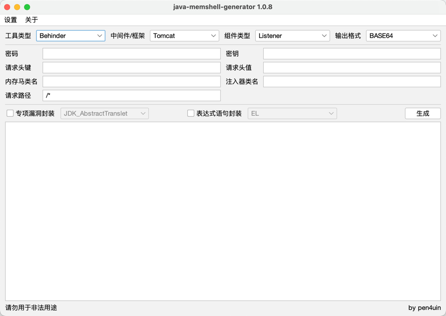

<h4 align="right"><strong><a href="jmg-docs/README_EN.md">English</a></strong> | 中文 </h4>
<p align="center">
  <h1 align="center">Java Memshell Generator</h1>
  <div align="center">
    
    
    
  </div>
  <div align="center">一款支持高度自定义的 Java 内存马生成工具</div>
</p>



<br>

> [!WARNING]
> 本工具仅供安全研究和学习使用。使用者需自行承担因使用此工具产生的所有法律及相关责任。请确保你的行为符合当地的法律和规定。作者不承担任何责任。如不接受，请勿使用此工具。

<br>

## 功能

| 中间件       | 框架            | 工具 (测试版本)                                                        | 内存马类型         | 输出格式       | 辅助模块    |
|-----------|---------------|------------------------------------------------------------------|---------------|------------|---------|
| Tomcat    | SpringMVC     | [AntSword](https://github.com/AntSwordProject/antSword) (2.1.15) | Listener      | BASE64     | 专项漏洞封装  |
| Resin     | SpringWebFlux | [Behinder](https://github.com/rebeyond/Behinder) (4.0.7)         | Filter        | BCEL       | 表达式语句封装 |
| WebLogic  |               | [Godzilla](https://github.com/BeichenDream/Godzilla) (4.0.1)     | Interceptor   | BIGINTEGER |         |
| Jetty     |               | [Neo-reGeorg](https://github.com/L-codes/Neo-reGeorg) (5.1.0)    | HandlerMethod | CLASS      |         |
| WebSphere |               | [Suo5](https://github.com/zema1/suo5) (0.9.0)                    |               | JAR        |         |
| Undertow  |               | Custom                                                           |               | JAR_AGENT  |         |
| GlassFish |               |                                                                  |               | JS         |         |
|           |               |                                                                  |               | JSP        |         |

## 编译

- maven

```shell
mvn package assembly:single
```

- jmg-gui

```shell
java -jar ./jmg-gui/target/jmg-gui-1.0.8-jar-with-dependencies.jar
```

## 文档

- [jMG v1.0.8](./jmg-docs/1.0.8/)
- [jMG v1.0.6](./jmg-docs/1.0.6/)
- [jMG v1.0.5](./jmg-docs/1.0.5/)
- [jMG v1.0.4](./jmg-docs/1.0.4/)

## 致谢

- https://github.com/c0ny1
- https://github.com/whwlsfb
- https://github.com/feihong-cs/memShell
- https://github.com/su18/MemoryShell
- https://github.com/BeichenDream/GodzillaMemoryShellProject

## 协议

- MIT