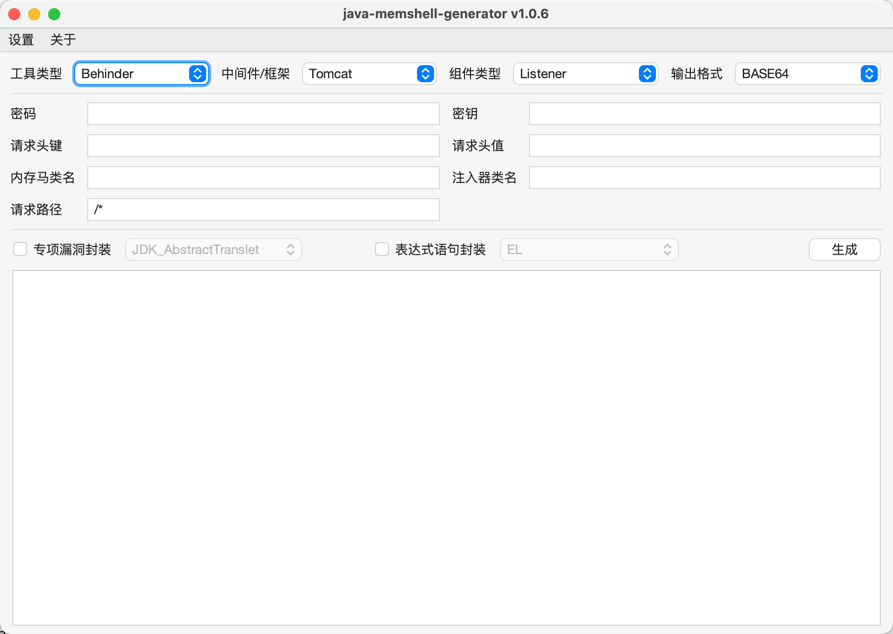

# Java Memshell Generator

## 0x01 Introduce

**jMG (Java Memshell Generator)** 是一款支持高度自定义的 Java 内存马生成工具，提供常见中间件的内存马注入支持。

主要功能如下：
- 支持的中间件和框架 (Tomcat/Resin/Jetty/WebLogic/WebSphere/Undertow/GlassFish/SpringMVC/SpringWebFlux)
- 支持的工具 (AntSword/Behinder/Godzilla/Suo5)
- 支持的内存马类型 (Filter/Listener/Interceptor/HandlerMethod)
- 支持的输出格式 (BASE64/BCEL/CLASS/JS/JSP/JAR/BIGINTEGER)
- 支持的辅助模块 (专项漏洞封装/表达式语句封装)

> 此工具仅限于安全研究和教学，用户承担因使用此工具而导致的所有法律和相关责任！ 作者不承担任何法律和相关责任！


## 0x02 Usage

下载 jMG-GUI.jar 运行即可




## 0x03 Contributor

```text
奇安信观星实验室(SGLAB of Legendsec at Qi'anxin Group)
```


## 0x04 Reference

使用手册
- [jMG v1.0.4](https://mp.weixin.qq.com/s/oAiGWY9ABhn2o148snA_sg)
- [jMG v1.0.5](https://mp.weixin.qq.com/s/QjoRs_J5jVANrdEiiTtVtA)
- [jMG v1.0.6](https://mp.weixin.qq.com/s/0ZzH35aRUPelq8nwilMQiA)

参考项目
- https://github.com/woodpecker-appstore/jexpr-encoder-utils
- https://github.com/feihong-cs/memShell
- https://github.com/su18/MemoryShell
- https://github.com/BeichenDream/GodzillaMemoryShellProject
- https://github.com/whwlsfb/cve-2022-22947-godzilla-memshell
