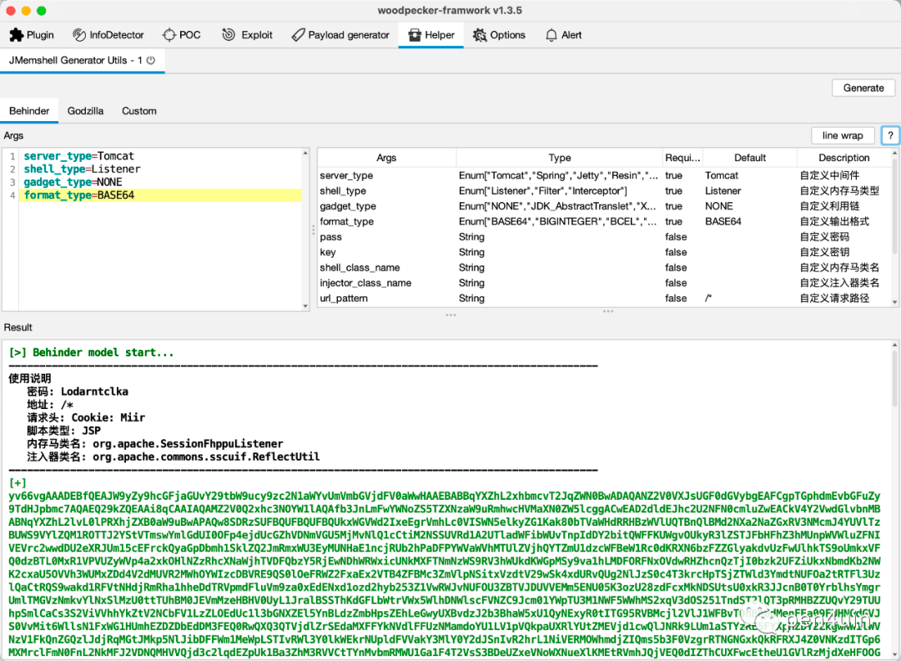

# jMG v1.0.5

## 0x01 前言

上篇文章中介绍了该工具作为 woodpecekr 插件的工作模式，并通过多个代码执行漏洞场景进行了演示。

本篇文章是在添加对GUI 工作模式支持后的补充。

## 0x02 工具简介

**jMG (Java Memshell Generator)** 是一款支持高度自定义的 Java 内存马生成工具，提供常见中间件的内存马注入支持。不仅可作为 woodpecker 的插件使用，也可以作为独立的 GUI 工具进行使用。

## 0x03 工作模式

### 插件 for Woodpecker

### 独立 GUI 

## 0x04 小结

免责声明
> 该工具仅适用于在授权环境/测试环境进行使用，请勿用于生产环境。

 
参考
- https://github.com/feihong-cs/memShell
- https://github.com/su18/MemoryShell
- https://github.com/BeichenDream/GodzillaMemoryShellProject
- https://github.com/woodpecker-framework/
- https://github.com/woodpecker-appstore/jexpr-encoder-utils

