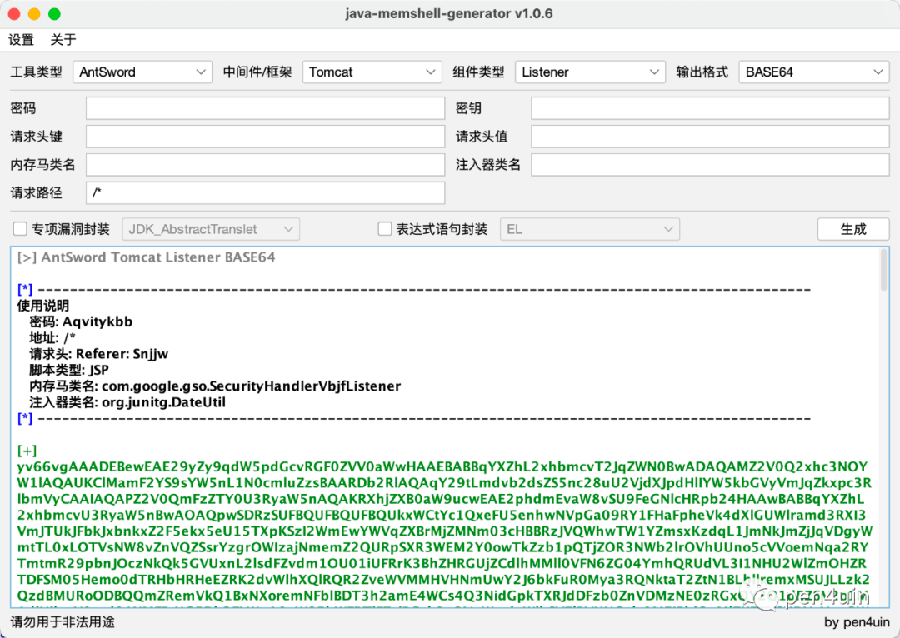
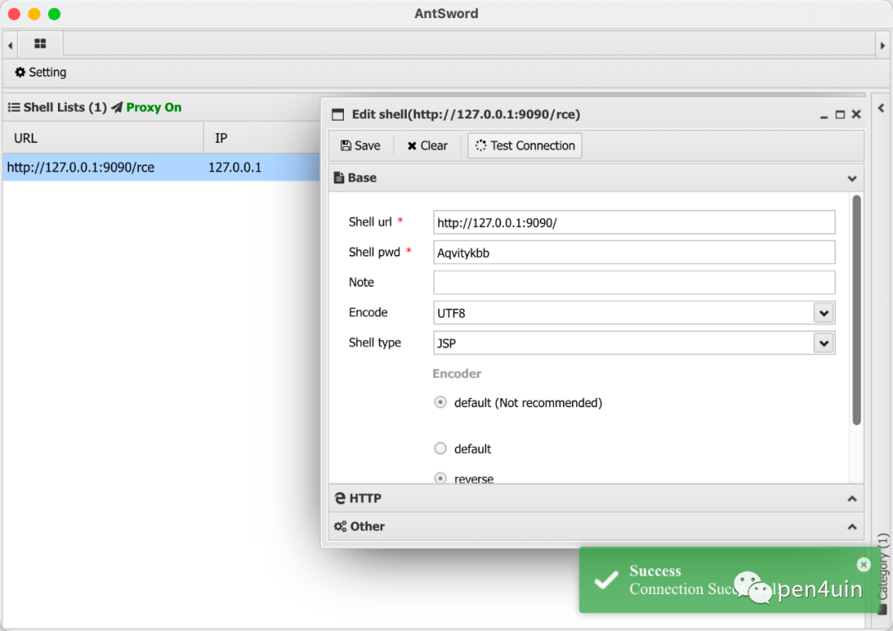
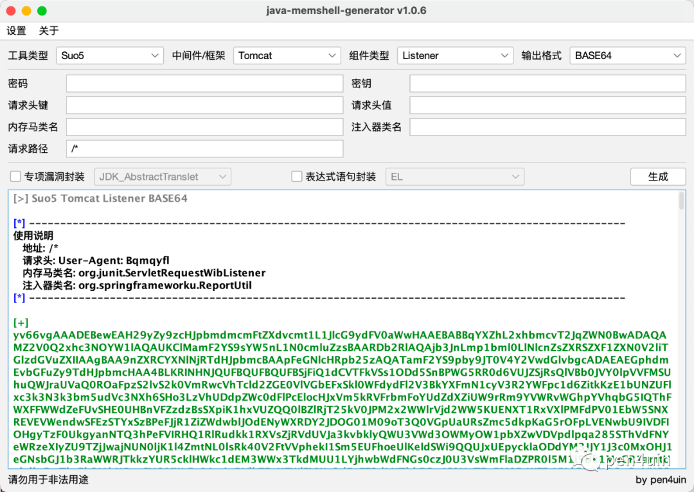
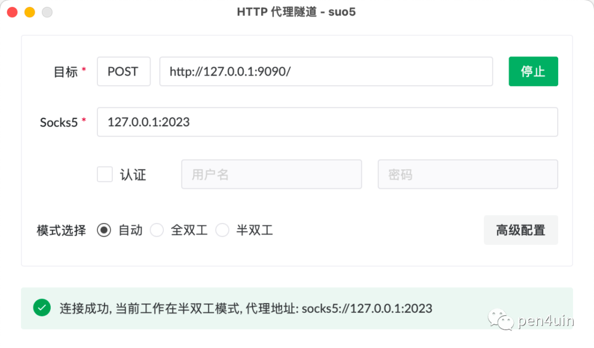
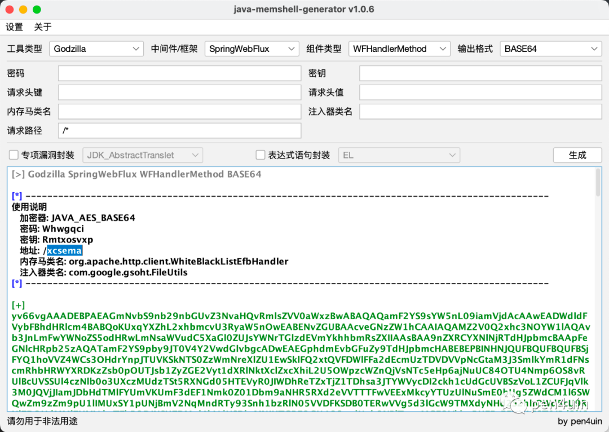
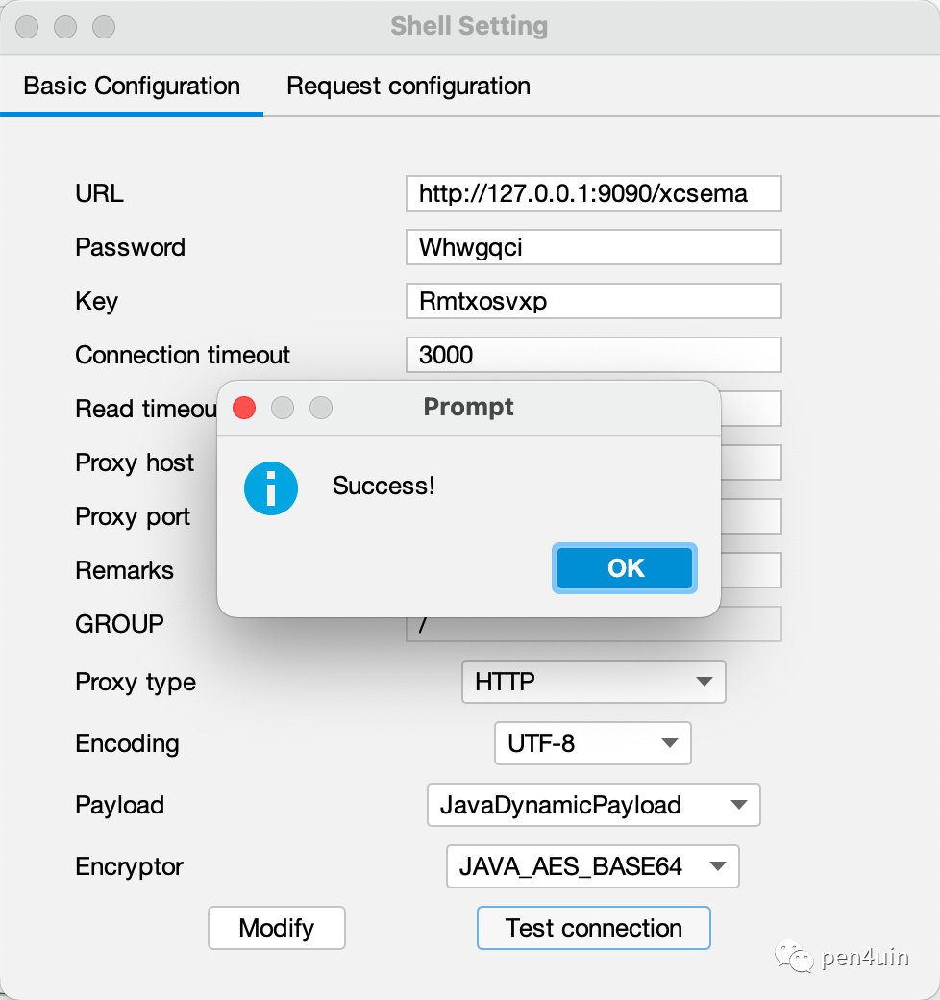
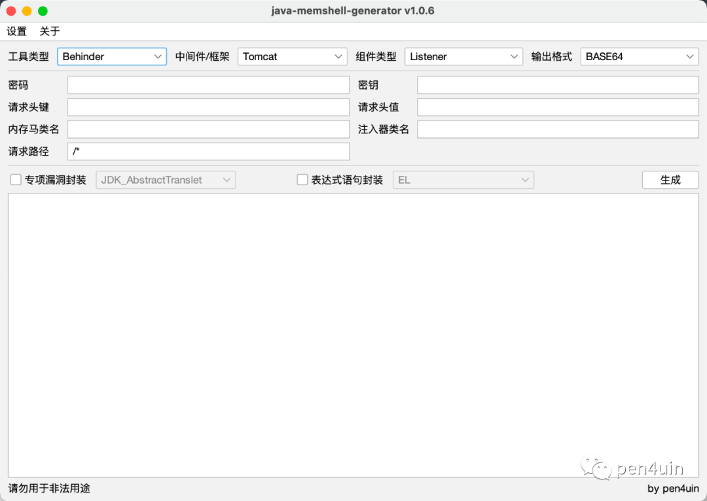
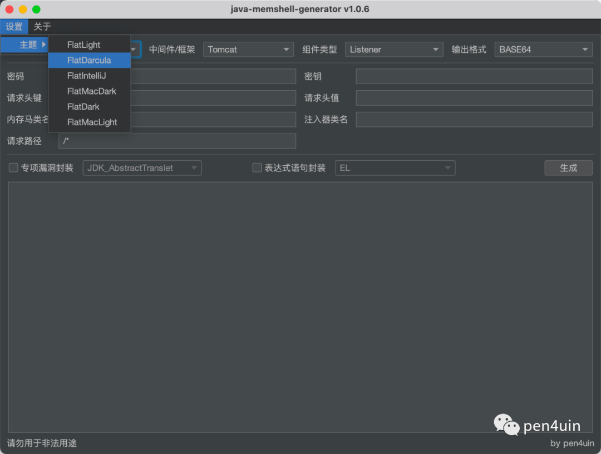

# jMG v1.0.6

## 0x01 前言

jMG（Java Memshell Generator）v1.0.6 完成了来自社区师傅们的大部分反馈和需求。

## 0x02 更新日志
核心模块

- 新增对网站管理工具「AntSword」的支持，提供 Listener/Filter 类型内存马的注入
- 新增对HTTP代理工具「Suo5」 的支持，提供 Listener/Filter/Interceptor 类型内存马的注入
- 新增对响应式框架 Spring WebFlux 内存马的支持
- 修复中间件 WebSphere 注入器的 Bug
- 删除class 的SourceFileAttribute (源文件名) 信息

使用体验

- 新增设置菜单，支持多种主题切换
- 新增右键菜单，支持以文件保存结果
- 其他优化

## 0x03 功能测试

### AntSword

1、选择工具类型为 AntSword，生成 payload

2、注入后按照使用说明进行连接

### Suo5

> 感谢Koalr师傅提供的suo5 listener/interceptor server端

1、选择工具类型为 Suo5，生成 payload

2、注入后按照使用说明进行连接

### Spring WebFlux

本地测试环境

- SpringBoot 2.7.15
- spring-webflux-5.3.29.jar

1、选择工具类型为 Godzilla，生成 payload（目前只适配了 Godzilla）

2、注入后按照使用说明进行连接

### 主题切换

此更新主要是为了提升用户体验。

默认 - FlatLightLaf

其他 - FlatDarcula

## 0x04 小结

jMG 目前已经基本覆盖大部分场景的内存马利用需求。

